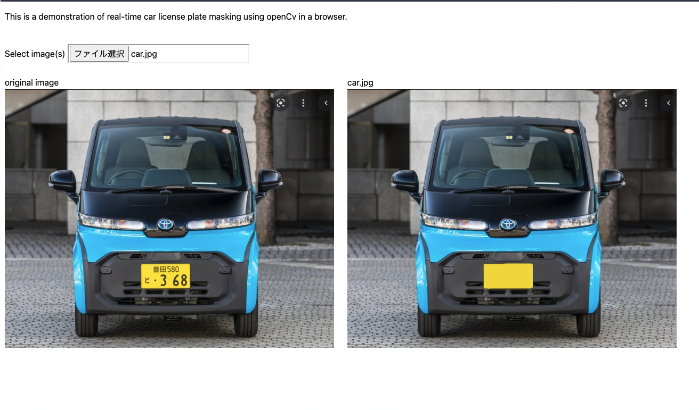

# car number detect and masking
Detect the car number and masking the plate number in browser.
- License plate removal with OpenCV run on PyScript :  

  [Demo Here]( https://ramesh2012.github.io/car-number-plate-masking/)
  ### Breakdown the Algorithm.
  
  1. Detect the license plate is located on uploaded images.
  2. Approximate license plate’s background color
  3. Fill the license plate with the same color which we calculated.

  
### Requirements


[PyScript Css](https://pyscript.net/latest/pyscript.css)

[PyScript JS](https://pyscript.net/latest/pyscript.js)

[pyodide-0.21.3](https://cdn.jsdelivr.net/pyodide/v0.21.3/full/pyodide.js)

python packages opencv-python & Pillow for dependencies.

## Getting Started for PyScript

PyScript is a Python front-end framework that enables users to construct Python programs using an HTML interface in the browser.

It was developed using the power of Emscripten, Pyodide, WASM, and other modern web technologies.

## How does PyScript work?

PyScript builds upon Pyodide, which ports CPython to WebAssembly. WebAssembly is a low-level binary format that allows you to write programs in other languages, which are then executed in the browser. With CPython in WebAssembly, we can install and run Python packages in the browser, while PyScript abstracts most of the Pyodide operations, allowing you to focus on building frontend apps with Python in the browser.

## Development setup

PyScript does not require any development environment other
than a web browser (we recommend using [Chrome](https://www.google.com/chrome/)) and a text editor, even though using your [IDE](https://en.wikipedia.org/wiki/Integrated_development_environment) of choice might be convenient.


## Installation

There is no installation required. In this document, we'll use
the PyScript assets served on [https://pyscript.net](https://pyscript.net).

## Your first PyScript HTML file

Here's a "Hello, world!" example using PyScript.

```html
<html>
  <head>
    <link rel="stylesheet" href="https://pyscript.net/latest/pyscript.css" />
    <script defer src="https://pyscript.net/latest/pyscript.js"></script>
  </head>
  <body> <py-script> print('Hello, World!') </py-script> </body>
</html>
```

## More References

1. [The PyScript official](https://pyscript.net/)
2. [Intro to PyScript: Run Python in the browser](https://blog.logrocket.com/pyscript-run-python-browser/)
3. [PyScript example](https://pyscript.net/examples/)
4. [Guide on getting started with PyScript.](https://github.com/pyscript/pyscript/blob/main/docs/tutorials/getting-started.md)